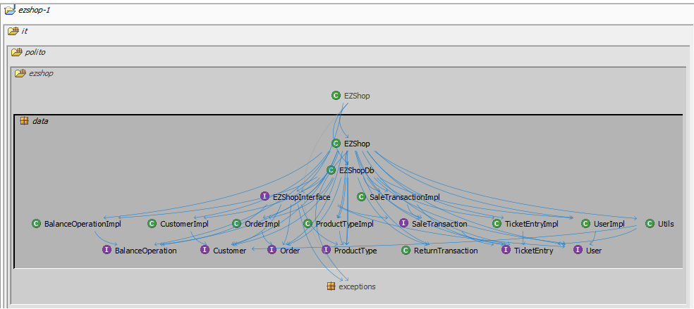
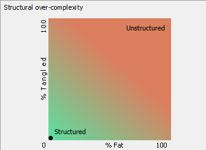
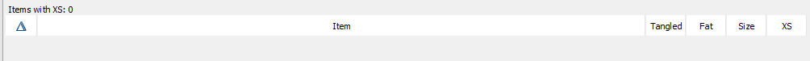
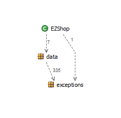

# Design assessment


```
<The goal of this document is to analyse the structure of your project, compare it with the design delivered
on April 30, discuss whether the design could be improved>
```

# Levelized structure map
```
<Applying Structure 101 to your project, version to be delivered on june 4, produce the Levelized structure map,
with all elements explosed, all dependencies, NO tangles; and report it here as a picture>
```
  

# Structural over complexity chart
```
<Applying Structure 101 to your project, version to be delivered on june 4, produce the structural over complexity chart; and report it here as a picture>
```
  


# Size metrics

```
<Report here the metrics about the size of your project, collected using Structure 101>
```


| Metric                                    | Measure |
| ----------------------------------------- | ------- |
| Packages                                  | 5        |
| Classes (outer)                           | 39        |
| Classes (all)                             | 40        |
| NI (number of bytecode instructions)      | 7942        |
| LOC (non comment non blank lines of code) | 3415        |


# Items with XS

```
<Our code doesn't contain any fat methods>
```




# Package level tangles

```
<Our project doesn't contain any recursive dependencies>
```

  

# Summary analysis
```
<Discuss here main differences of the current structure of your project vs the design delivered on April 30>
<Discuss if the current structure shows weaknesses that should be fixed>
```
We have moved Utils class from it.polito.ezshop.utils to it.polito.ezshop.data in order to avoid any recursive dependencies; in the previous case, levelized structure map showed 97% of tangles.

The main differences of the current structure of our project and the design that we delivered on April 30 are:

- The actual design doesn't use any maps because we created DB class "EZShopDB" to manage data persistence.

- EZShopData class is renamed as EZShop and Sale Item is renamed as TicketEntry.

- In the current version we excluded some classes such as AccountBook, Credit, Debit etc. because they were not necessary for our aim.

- Position and fidelity card are not anymore classes because we just stored them as string(in the previous version we had Position and Fidelity card classes).


