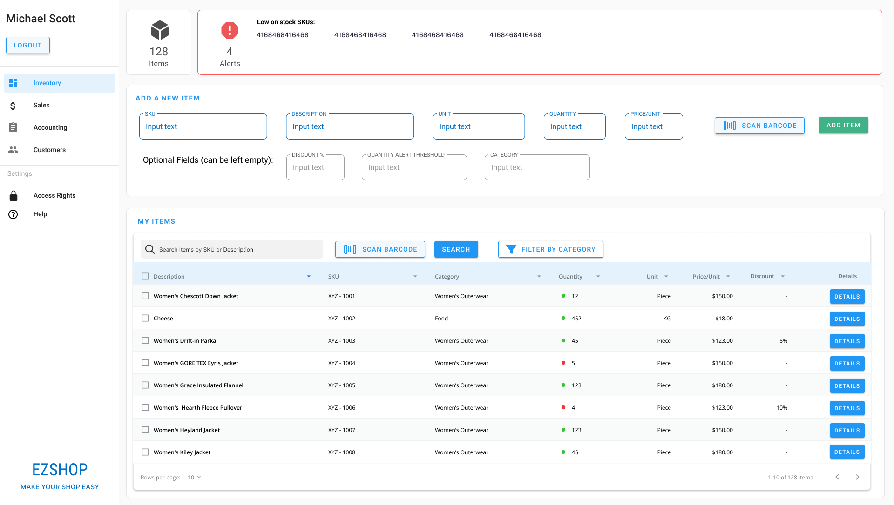
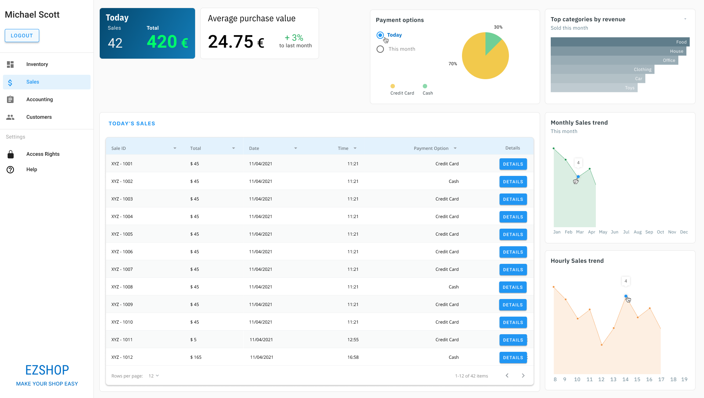
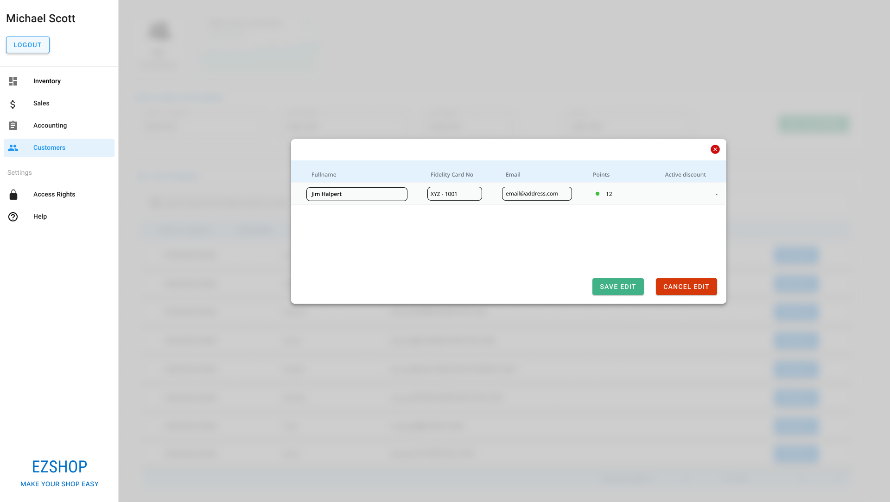

# Graphical User Interface Prototype

Authors: Diego Marino, Michele Massetti, Mohamed Shehab, Elisa Tedde

Date: 21/04/2021

Version: 1.0

\<Report here the GUI that you propose. You are free to organize it as you prefer. A suggested presentation matches the Use cases and scenarios defined in the Requirement document. The GUI can be shown as a sequence of graphical files (jpg, png) >

# Sceenshots

# Screenshot 1: Log in

The EzShop application starts with screenshot 1.

- employees with ID and password access to the application by inserting their credentials;

- new employees without ID have to ask for their ID to the owner, after receiving it, employee set his own password during the sign up;

- employee who forgets the password, has to contact the owner to reset the password and then he proceeds with sign up again, during the sign up, employee set his own password.

- If the owner forgets his password he has to contact EZ shop support

<table>
<tbody>
  <tr>
    <td></td>
    <td></td>
    </tr><tr>
    <td></td>
  </tr>
</tbody>
</table>

# Screenshot 2: Inventory

In this section the employee manages items in the inventory.

- insert item: the employee can insert a new item, filling the fields with its specifications;

- edit item: the employee can modify some item fields or he can add some optional info such as category, discount or quantity alert threshold. Then he has to confirm or not his edit;

- search items: the employee can search a specifc item by inserting its SKU or desription, or he can use a category filter to obtain a subset of items. If he doesn't find any info, he should adjust his search.

- delete item: the employee can delete a specific item by selecting it and clicking the "delete" button.
<table>
<tbody>
  <tr>
    <td></td>
    <td></td></tr><tr>
    <td></td>
    <td></td>
  </tr>
</tbody>
</table>

# Screenshot 3: Sales

In this section the employee consults some daily statistics.

It provides:

- the sales list of the current day with some details

- the number of sales and the total income of the current day;

- monthly, hourly and top categories sales trend

- payment option chart

<table>
<tbody>
  <tr>
    <td></td>
  </tr>
</tbody>
</table>

# Screenshot 3: Accounting

This section is divided into 3 parts: expenses, revenue and report. Here the employee manages the EZ shop accounting.

- Expenses part: the employee can consult the total monthly cost (fixed and variable expenses are also available). Additionally, he can add a new expense and search it using some filters. He can also export this info to an excel file;

- Revenue part: the employee can consult the monthly revenue with all details selecting the appropriate time windows;

- Report part: it is shown some economical measures such as profit;

<table>
<tbody>
  <tr>
    <td></td>
    <td></td></tr><tr>
    <td></td>
  </tr>
</tbody>
</table>

# Screenshot 4: Transaction

This branch provides some option for the managing of transaction.

- Cashier associates the sale to the fidelity card, scanning it with the barcode reader;

- Cashier resets the payment option without removing the items from the cart;

- Cashier can put in pending a sale transaction and proceeding with another one;

- Cashier denies the entire order through "void" button.

Buttons were designed big in order to make the interface more user friendly.

<table>
<tbody>
  <tr>
    <td></td>
    <td></td></tr><tr>
    <td></td>
    <td></td>
  </tr>
</tbody>
</table>

# Screenshot 5: Customer

In this section the employee manages customers data.

- insert customer data: the employee can insert a new customer, filling the fields with its specifications. Additionally, he can link it with a fidelity card;

- edit customer data: the employee can modify some customer fields;

- search a customer: the employee can search a specific customer by inserting his full name or fidelity card number;

- delete customer: the employee can delete a specific customer by selecting it and clicking the "delete" button.

The owner decides the threshold of points and the respective discount of the fidelity program: when the customer has enough fidelity points, he obtains the discount.

<table>
<tbody>
  <tr>
    <td></td>
    <td></td></tr><tr>
    <td></td>
  </tr>
</tbody>
</table>

# Screenshot 6: Access Rights

The following division allows owner to manage the employees profile: he can create a new user, remove one, he decides the rights of an employee.

He has the rights to reset the password of a profile.

<table>
<tbody>
  <tr>
    <td></td>
    <td></td></tr>
</tbody>
</table>
